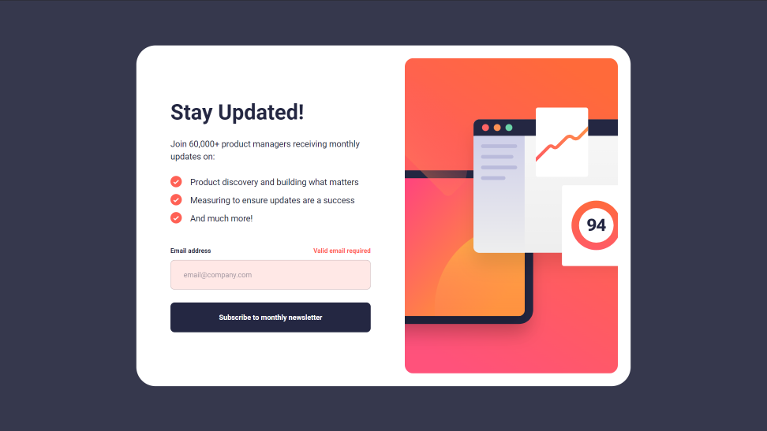

# Frontend Mentor - Newsletter sign-up form with success message solution

This is a solution to the [Newsletter sign-up form with success message challenge on Frontend Mentor](https://www.frontendmentor.io/challenges/newsletter-signup-form-with-success-message-3FC1AZbNrv). Frontend Mentor challenges help you improve your coding skills by building realistic projects. 

## Table of contents

- [Overview](#overview)
  - [The challenge](#the-challenge)
  - [Screenshot](#screenshot)
  - [Links](#links)
- [My process](#my-process)
  - [Built with](#built-with)
  - [What I learned](#what-i-learned)
  - [Continued development](#continued-development)
- [Author](#author)

## Overview

### The challenge

Users should be able to:

- Add their email and submit the form
- See a success message with their email after successfully submitting the form
- See form validation messages if:
  - The field is left empty
  - The email address is not formatted correctly
- View the optimal layout for the interface depending on their device's screen size
- See hover and focus states for all interactive elements on the page

### Screenshot

### Links

- Solution URL: [GitHub Repo](https://github.com/ryanbradley-webdev/newsletter-signup)
- Live Site URL: [Hosted on Netlify](https://newsletter-signup-rbwd.netlify.app/)

## My process

### Built with

- [React](https://reactjs.org/) - JS library

### What I learned

I'm continuing to learn how to adapt designs to varying screen sizes in an appropriate way. For this project I decided to base the breakpoints around the minimum width of the desktop form component and maintain a constant mobile-sized form for smaller screens. This way I kept the design consistent without having to invent new designs for mobile.

### Continued development

My method of form validation is continuing to evolve. As my technique improves, I'll apply it to older projects like this one.

## Author

- Portfolio - [ryanbradleyportfolio.com](https://ryanbradleyportfolio.com)
- Frontend Mentor - [@ryanbradley-webdev](https://www.frontendmentor.io/profile/ryanbradley-webdev)
- Instagram - [@yourusername](https://www.instagram.com/ryanbradley_web_dev/)